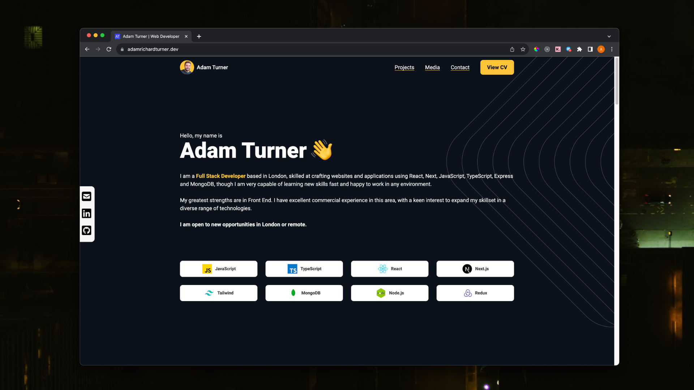

# Adam Turner Portfolio | Next.js, TypeScript and Tailwind Single Page Portfolio

This is my professional developer portfolio showcasing a curation of selected projects that highlight my skills and interests as a full stack developer, including my CV, other media and contact details.

The portfolio was written primarily with TypeScript using the Next.js framework.

Tailwind was used for styling components.

The design itself was custom made for me by professional UI/UX designer [Wayne Hsu.](https://www.linkedin.com/in/waynehsu0909/)

# Preview



# Live Website

You can view this portfolio in its most up-to-date form at [https://adamrichardturner.dev](https://adamrichardturner.dev)

## Getting Started

First, run the development server:

```bash
npm run dev
# or
yarn dev
# or
pnpm dev
```
